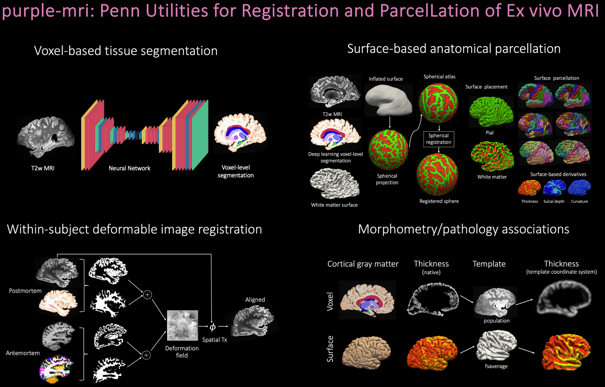

purple-mri
==========

purple-mri (Penn Utilities for Registration and Parcellation of Ex Vivo MRI) is a computational framework for segmentation, registration, surface reconstruction, and atlas-based parcellation of ultra–high-resolution postmortem human brain MRI.

The toolkit is designed for ex vivo whole-hemisphere MRI acquired at submillimeter resolution (often <300µm) at ultra-high field strengths (e.g., 7T), where conventional in vivo pipelines fail due to fixation-driven contrast shifts, specimen-specific geometry, and extreme spatial resolution.

purple-mri integrates deep learning–based voxel segmentation with classical surface-based modeling to produce topology-stable cortical reconstructions and native-space atlas parcellations suitable for vertex-wise and group-level morphometric analysis.

.. image:: _static/animation.gif
   :width: 900px
   :align: center

Introductory Video
------------------
.. raw:: html

   

     
   

Core Capabilities
-----------------
purple-mri enables:
* Automated multi-label tissue segmentation of postmortem MRI
* Topology-aware cortical ribbon refinement
* Native-space surface reconstruction
* Surface-based parcellation using established atlases (e.g., DKT, Schaefer, Glasser, von Economo–Koskinas)
* Ex vivo ↔ in vivo volumetric registration using classical optimization methods and modern deep learning-based ones
* Intensity-based population-specific volumetric template construction
* Vertex-wise statistical modeling (e.g., GLM analyses in template space) allowing the integration of morphometric measures with external biological variables

Scientific Context
------------------
We have applied our tools across a spectrum of ultra-high-resolution multi-modal ex vivo MRI spanning from developmental disorders (Sudden Infant Death Syndrome) in infants to neurodegenerative diseases (Alzheimer’s disease and related dementias) in adults. Our toolkit purple-mri has enabled systematic analysis of ultra-high-resolution postmortem MRI linking pathology to in vivo MRI via ex vivo MRI to allow discovery of region-specific morphometry–pathology signatures that can inform the development of disease-specific in vivo biomarkers.

.. toctree::
   :maxdepth: 1
   :caption: Getting Started

   overview
   installation

.. toctree::
   :maxdepth: 1
   :caption: Workflows

   segmentation
   posthoc_correction
   parcellation
   registration
   template_construction
   group_analysis

.. toctree::
   :maxdepth: 1
   :caption: Reference

   citations

.. raw:: html

   

   
   
   
   
   
   

.. list-table::
   :align: center
   :widths: 16 16 16 16 16 16

   * - .. image:: _static/python.png
          :width: 55px
     - .. image:: _static/pip.png
          :width: 55px
     - .. image:: _static/docker.png
          :width: 55px
     - .. image:: _static/singularity.png
          :width: 55px
     - .. image:: _static/fs.png
          :width: 55px
     - .. image:: _static/itksnap.png
          :width: 55px
