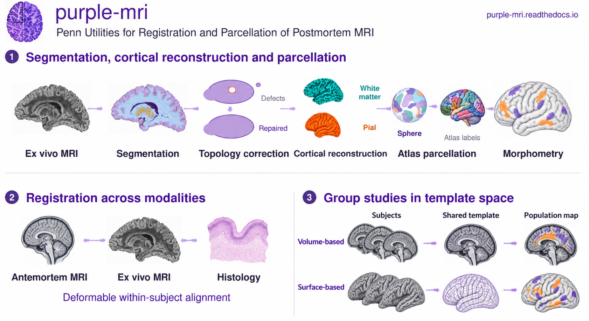
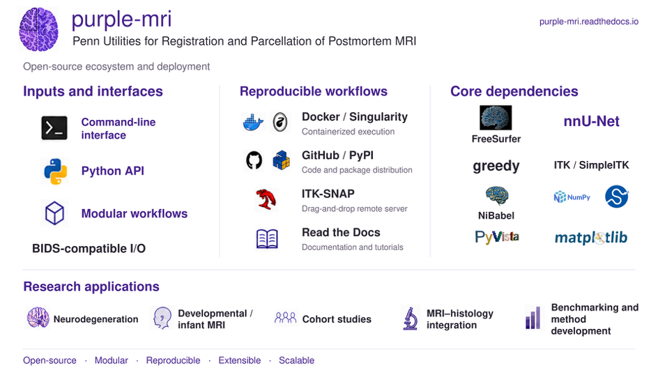

purple-mri
==========

``purple-mri`` (**PURPLE-MRI**; Penn Utilities for Registration and Parcellation of Ex vivo MRI)
is a computational framework for segmentation, registration, cortical surface
reconstruction, anatomical parcellation, and group-level analysis of
ultra-high-resolution postmortem human brain MRI.

The toolkit was originally developed for ex vivo whole-hemisphere MRI acquired
at submillimeter resolution, including approximately 300 µm isotropic 7 Tesla
MRI, where conventional in vivo neuroimaging pipelines face challenges related
to fixation-driven contrast changes, specimen-specific geometry, tissue
sampling, and extreme spatial resolution.

``purple-mri`` combines deep learning-based voxel segmentation with classical
image-registration and surface-based modeling methods to produce
topology-corrected cortical reconstructions, native-space anatomical
parcellations, spatial normalization, and vertex-wise morphometric analyses.

.. image:: _static/animation.gif
   :width: 900px
   :align: center

Introductory Video
------------------

.. raw:: html

   

     
   

Core Capabilities
-----------------

``purple-mri`` provides tools for:

* automated multi-label segmentation of postmortem MRI;
* deep learning-based post-hoc correction of buried-sulcus regions;
* native-space cortical surface reconstruction;
* white- and pial-surface modeling;
* surface-based anatomical parcellation using multiple established cortical
  atlases, including DKT, Destrieux, Schaefer, HCP-MMP1/Glasser, Jülich,
  Brainnetome, and von Economo-Koskinas;
* infant-specific cortical reconstruction and parcellation, including M-CRIB-S;
* ex vivo to in vivo volumetric registration using classical optimization and
  learning-based methods;
* population-specific volumetric template construction;
* cortical morphometry including thickness, area, and curvature;
* ROI-wise and vertex-wise statistical analysis in a common template space;
* integration of imaging-derived morphometry with histopathology and other
  biological measurements.

Development and Evolution
-------------------------

``purple-mri`` originated at the **University of Pennsylvania** in the
`Penn ADRD Trajectories, Copathology, and Heterogeneity (PATCH) Lab
<https://patchlab.pennbrain.upenn.edu/>`_ within the
`Penn Image Computing and Science Laboratory (PICSL)
<https://www.med.upenn.edu/sbia/>`_.

The framework was conceived by **Pulkit Khandelwal and Paul A. Yushkevich**
and grew out of Khandelwal's doctoral research at Penn on the computational
analysis of ultra-high-resolution postmortem MRI in Alzheimer's disease and
related dementias.

The initial development focused on segmentation, image registration, cortical
surface reconstruction, anatomical parcellation, spatial normalization, and
quantitative morphometric analysis of high-resolution postmortem human brain
MRI.

The development of ``purple-mri`` was closely integrated with Penn's broader
neurodegeneration research ecosystem. Collaborations with the
`Penn Alzheimer's Disease Research Center (ADRC)
<https://www.med.upenn.edu/adrc/>`_ and the
`Penn Frontotemporal Degeneration Center (FTDC)
<https://www.med.upenn.edu/ftd/>`_ enabled the methods to be developed and
evaluated across deeply characterized postmortem brain specimens spanning
Alzheimer's disease, Lewy body disease, frontotemporal lobar degeneration,
and related neuropathologies.

Through the PATCH Lab, these efforts brought together computational
neuroimaging at PICSL with postmortem MRI, neuropathology, and clinical
characterization from the Penn ADRC, Penn FTDC, and collaborating Penn
research programs. This environment enabled ``purple-mri`` to evolve from
individual image-processing methods into an integrated framework for studying
structure-pathology relationships across the postmortem human brain.

The framework has subsequently expanded beyond its original focus on adult
neurodegenerative disease. At
`Massachusetts General Hospital (MGH)
<https://www.massgeneral.org/>`_ and
`Harvard Medical School
<https://hms.harvard.edu/>`_, work at the
`Athinoula A. Martinos Center for Biomedical Imaging
<https://www.martinos.org/>`_ has extended ``purple-mri`` toward
high-resolution multimodal postmortem imaging of the developing human brain.

In collaboration with investigators at
`Boston Children's Hospital
<https://www.childrenshospital.org/>`_, these developments have included
cortical reconstruction and anatomical parcellation of postmortem infant MRI,
infant-specific atlas mapping, multimodal image analysis, and comparison with
normative in vivo brain development.

``purple-mri`` has therefore evolved from a framework developed for adult
7 Tesla postmortem MRI in Alzheimer's disease and related dementias into a
broader computational platform for studying human brain anatomy across the
lifespan, from early postnatal development to late-life neurodegeneration.

Scientific Context
------------------

Postmortem MRI provides a bridge between macroscopic neuroimaging and
microscopic neuropathology.

Ultra-high-resolution MRI of fixed human brain tissue can reveal anatomical
patterns that are difficult to resolve with conventional in vivo imaging,
while retaining a three-dimensional coordinate system in which imaging,
histology, pathology, and antemortem measurements can be related.

``purple-mri`` was developed to support this type of multiscale analysis.

In adult neurodegenerative disease, the framework enables whole-hemisphere
morphometric analyses and spatial association of cortical and subcortical
anatomy with neuropathological measurements.

In developmental applications, the same computational framework is being
extended to high-resolution multimodal postmortem infant MRI, allowing
cortical anatomy and developmental patterns to be compared with normative
in vivo imaging.

Workflow
--------

A typical ``purple-mri`` analysis follows the sequence:

.. code-block:: text

   Postmortem MRI
         |
         v
   Pre-processing
         |
         v
   Deep learning segmentation
         |
         v
   Post-hoc topology correction
         |
         v
   Cortical surface reconstruction
         |
         v
   Anatomical parcellation
         |
         +----------------------+
         |                      |
         v                      v
   Spatial registration    Cortical morphometry
         |                      |
         +----------+-----------+
                    |
                    v
          Group / vertex-wise analysis
                    |
                    v
      Imaging-pathology associations

Getting Started
---------------

Start with the installation instructions and then follow the individual
workflow pages for segmentation, topology correction, surface reconstruction,
parcellation, registration, template construction, and group analysis.

.. toctree::
   :maxdepth: 1
   :caption: Getting Started

   installation

.. toctree::
   :maxdepth: 1
   :caption: Workflows

   segmentation
   posthoc_correction
   parcellation
   registration
   template_construction
   group_analysis

.. toctree::
   :maxdepth: 1
   :caption: Reference

   citations

Software Ecosystem
------------------

Development and Collaborating Institutions
------------------------------------------

``purple-mri`` was initiated at Penn and has continued to evolve through
collaborative research at Penn Medicine, the PATCH Lab, Harvard Medical School,
the Athinoula A. Martinos Center for Biomedical Imaging, and Mass General
Brigham.

.. raw:: html

   

     

     

     

     

     

   

